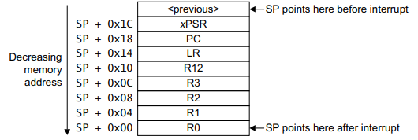

# QEMU Mini Cortex-M RTOS Kernel

QEMU : lm3s6965evb

## The steps of this kernel

## 1. Boot Step

The booting step works like this: after the processor resets, the first thing it will do is read the vector table. The vector table includes the address of the initial stack pointer located at the end of the stack (the top of RAM) and the address of the Reset_Handler. Reset_Handler will run, which initializes the memory before calling main() by copying initialized FLASH values to RAM and zeroing .bss values. At main() it will run forever, thus finishing the boot process.

You can prove that this steps works by using a debugger to read the `initialized_global` and `zero_global` values, then running `reached_main` after reaching `main()`. It should look like this:

```
main () at boot.c:27
27        while (1) {
(gdb) break main
Breakpoint 1 at 0xc: file boot.c, line 26.
(gdb) print reached_main
$1 = 1
(gdb) print zero_global
$2 = 0
(gdb) print initialized_global
$3 = 123
(gdb) 
```


## 2. Interrupts and SysTick

This operating system uses SysTick, which gives us a simple first interrupt source/tool because the hardware of the ARM Cortex-M does most of the work. After the booting step, the next step is setting the values in specified memory addresses to initialize the systick, which is a counter that helps the OS know if time passed.

For this QEMU board, the system clock is approximately 12.5 MHz. For SysTick, there are three values we need to set: 1) the `Control and Status Register`, 2) the `Reload Value Register`, and 3) the `Current Value Register`, where:

Control and Status Register (SYST_CSR) == # of clock cycles between ticks
Reload Value Register (SYST_RVR) == clears/restarts the current countdown
Current Value Register (SYST_CVR) == enables SysTick, enables interrupts, and chooses clock source

For 12.5 MHz, to calculate how long SysTick should wait before firing an interrupt, 
12,500,000 Hz (# of ticks sent) / 1000 Hz (# of interrupts per sec) = 12,500 cycles per millisecond
reload = 12,500 - 1 = 12,499

So SysTick should count 12,500 ticks before sending an interrupt.

Here is gdb debug output verifying that this works:
```
Breakpoint 1, main () at boot.c:54
54        reached_main = 1;
(gdb) print tick_count
$1 = 0
(gdb) continue
Continuing.

Program received signal SIGINT, Interrupt.
main () at boot.c:65
65        while (1) {
(gdb) print tick_count
$2 = 4571
(gdb) 
```

## 3. Tasks

Tasks are the functions that the CPU will execute. Each task has its own stack, stack pointer (sp), id, and state. To organize tasks, this OS uses a TASKLIST and TASKSTACKS array.

When the system restarts/begins, each task's value is zero'd (as it is stored in .bss).

When we want to create a new task, we look for the first UNUSED task (task state being UNUSED). We take the new task and configure its stack to be executable, as if the task had already run previously, then we replace the UNUSED task in TASKLIST with the new task (set to READY).

When a task is interrupted, a part of its context is stored on its stack by the CPU, including updating the task's stack pointer. When that task is ready to be run, the CPU will restore the context from the stack and restore the stack. When creating a new task, we need to configure its stack with fake data as if it was previously interrupted, that way it can seamlessly be added to the system as if it had already existed.

The full task context includes:
```
R4-R11, which are manually restored
R0-R3
R12
LR
PC
xPSR, which is automatically restored by exception return
```

For a new task, `PC`, `xPSR`, `LR`, and `R0` are the most important values that need to be configured.


See `[Cortex-M3 Devices Generic User Guide](https://www.keil.com/dd/docs/datashts/arm/cortex_m3/r2p1/dui0552a_cortex_m3_dgug.pdf)`, page 39 on "Exception entry" for how this looks like on the stack frame and its details.

R11 to R4 follow after R0 and can be initialized to 0 for a new task.

## 3. Scheduler
comin soon

## 4. PendSV Context Switching
comin soon to githubs near u or sum


---

## Build

```bash
export PATH=/ucrt64/bin:$PATH
make
```

## Run In QEMU

```bash
export PATH=/ucrt64/bin:$PATH
qemu-system-arm -M lm3s6965evb -cpu cortex-m3 -kernel firmware.elf -nographic -S -s
# qemu-system-arm -M lm3s6965evb -cpu cortex-m3 -kernel firmware.elf -nographic
```


## Debug

```bash
export PATH=/ucrt64/bin:$PATH
gdb-multiarch firmware.elf
```


---

There may be small errors in this doc. I am writing this as I learn and develop this project.
